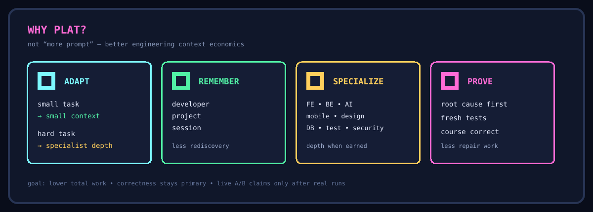
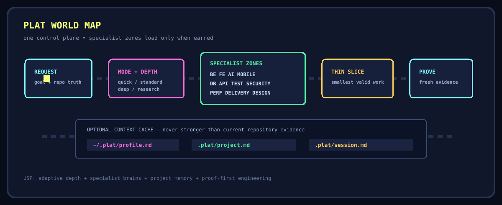
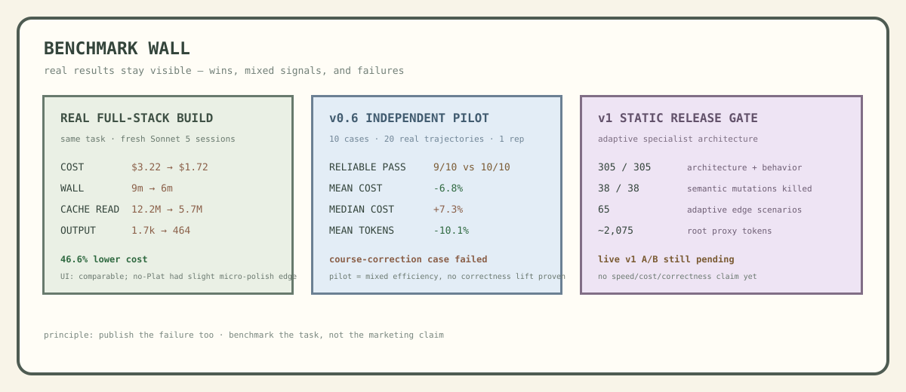

<div align="center">

# PLAT v1

### adaptive engineering for AI coding agents



[](https://github.com/harish-042002/harish-skills)
[](https://github.com/harish-042002/harish-skills/tree/plat-v0.7)
[](#)
[](#)

</div>

> **Plat is not a larger prompt.** It is an adaptive engineering control plane: understand the repo, choose the right depth, load only the specialist knowledge that can change the outcome, reuse verified context, course-correct from evidence, and prove before saying done.



## v0.7 is fully inside v1

The v1 branch was built **on top of v0.7**, not beside it. The full design stack remains:

`design-system` · `design-patterns` · `design-taste` · `design-motion` · `design-review`

v1 adds the same progressive-depth idea to repository understanding, debugging, backend/distributed systems, frontend, mobile, AI, testing, database, API, security, performance, delivery, and system design.



## One task does not load the whole office

```text
tiny/local change
→ Quick
→ almost no specialist context

normal feature
→ Standard
→ basic process + relevant domain

production race / major migration / hard AI issue
→ Deep
→ basic domain + the specialist that answers the hard question

architecture research / large-codebase understanding
→ Research
→ targeted map + evidence, read-only unless edits are requested
```

Optional context layers can make later sessions cheaper:

```text
~/.plat/profile.md       developer role / experience / response preference
.plat/project.md         verified project map / conventions / test commands
.plat/session.md         current task continuation state
```

They are caches, never authority:

```text
current request
> current repository/runtime evidence
> project profile
> developer profile
> Plat defaults
```



## Benchmark record

Plat keeps the positive and negative results together. The current evidence has **two different stories**:

- a real manual full-stack build showed a strong efficiency signal;
- the earlier independent 10-case v0.6 pilot showed mixed efficiency and one real correctness failure.

That is why v1 is not marketed as "2× cheaper" or "better at coding" yet.

<details>
<summary><strong>Real full-stack task-manager build — same prompt, fresh Sonnet 5 sessions</strong></summary>

| Metric | No Plat | Plat | Difference |
| --- | ---: | ---: | ---: |
| Input tokens | 210 | 106 | **-49.5%** |
| Output tokens | ~1.7k | 464 | **-72.7%** |
| Cache read | 12.2M | 5.7M | **-53.3%** |
| Cache write | 97.9k | 74.9k | **-23.5%** |
| Cost | $3.22 | $1.72 | **-46.6%** |
| API time | 7 min | 5 min | **-28.6%** |
| Wall time | 9 min | 6 min | **-33.3%** |

Both implementations passed the direct CRUD flow. The generated interfaces were visually comparable; the no-Plat version had a small edge in initial micro-copy/visual polish. This was **one manual build**, so it is a signal, not a general performance claim.

</details>

<details>
<summary><strong>Independent v0.6 pilot — all 10 scenarios</strong></summary>

10 cases × 2 conditions × 1 repetition = **20 real Claude Code Sonnet 5 trajectories**.

| Scenario | Plat | No Plat | Plat token delta | Plat cost delta | Plat time delta |
| --- | --- | --- | ---: | ---: | ---: |
| Bug root-cause | PASS | PASS | -180 | -$0.0325 | -2.7s |
| Existing-repo feature | PASS | PASS | -540 | -$0.0433 | -6.4s |
| Backend idempotency | PASS | PASS | +689 | +$0.0516 | +15.6s |
| Frontend states | PASS | PASS | -67 | -$0.0012 | -0.5s |
| Tiny edit | PASS | PASS | +8 | +$0.0001 | -1.5s |
| Performance reasoning | PASS | PASS | +11 | -$0.0122 | +2.3s |
| Verify-before-claim | PASS | PASS | +7 | +$0.0002 | -0.3s |
| **Course correction** | **FAIL** | **PASS** | -986 | -$0.0618 | -20.6s |
| Negative control | PASS | PASS | -25 | -$0.0003 | -0.5s |
| Lightweight feature | PASS | PASS | +88 | +$0.0019 | +2.5s |

Reliable deterministic assertions:

```text
No Plat  10 / 10
Plat      9 / 10
```

Aggregate pilot signals:

```text
mean tokens     Plat -10.1%
median tokens   Plat +33.5%

mean cost       Plat -6.8%
median cost     Plat +7.3%

mean time       Plat -8.1%
median time     Plat +27.6%
```

The mean/median disagreement came from outliers. There was **no demonstrated live correctness advantage**.

### The course-correction failure

The repository explicitly required an existing shared cache abstraction. The Plat run added a process-local module cache instead, while the no-Plat run found and reused the repository's `SharedCache`.

That failure directly informed v1's stronger repository-truth, deep-repository, and course-correction rules. It is kept in the benchmark record rather than hidden.

The harness also lacked reliable structured per-tool telemetry, so some "command ran / tests passed" assertions were not trustworthy. Future v1 runs should use an **external verifier after each trajectory**.

</details>

<details>
<summary><strong>v1 static release gate</strong></summary>

```text
305 / 305  deterministic architecture + behavior checks
38  / 38   semantic-control mutations killed
65          adaptive edge-case scenarios
36          directly routed specialist reference modules
0           known long duplicate instruction blocks
~2,075      proxy tokens in the always-loaded root router
~+76        proxy tokens vs v0.7 root (~3.8%)
```

This proves the routing/package structure, not live coding performance.

</details>

<details>
<summary><strong>Next v1 live benchmark matrix</strong></summary>

The frozen v1 benchmark should cover distinct reasons for Plat to exist:

| Case | Scenario | What it tests |
| --- | --- | --- |
| 1 | Tiny known-file edit | Does v1 stay out of the way? |
| 2 | Greenfield full-stack build | General engineering + total cost/time |
| 3 | Existing-repo feature | Pattern reuse and repository discovery |
| 4 | Production/intermittent bug | Deep debugging and competing hypotheses |
| 5 | Large-codebase research | Task-scoped mapping vs broad rereading |
| 6 | Frontend redesign | v0.7 design stack + rendered UI quality |
| 7 | RAG/agent regression | AI specialist routing + eval/cost reasoning |
| 8 | Live-compatible migration | API/DB/delivery coexistence and verification |

For every case:

```text
same repo state
same exact prompt
same model + settings
fresh session
No Plat vs Plat
external verifier
tokens + cache + cost + wall time + turns
diff / files / LOC / dependencies
correctness first
```

The next public efficiency claim should use the **median across repeated real tasks**, not one best-looking run.

</details>

## Use Plat normally

No commands or module names are required.

```text
"This endpoint occasionally creates duplicate invoices under load. Find the root cause."

"Understand this notification system before we change its scheduling."

"Build this screen using the current product design language."

"Our RAG quality dropped and token cost increased. Diagnose where."

"Migrate this API without breaking older mobile clients."
```

Plat decides how deep to go.

## Install

### Claude Code

```bash
npx skills add harish-042002/harish-skills --skill plat -g -a claude-code -y
```

### Codex

```bash
npx skills add harish-042002/harish-skills --skill plat -g -a codex -y
```

### Cursor

```bash
npx skills add harish-042002/harish-skills --skill plat -g -a cursor -y
```

Remove `-g` for project-local installation.

## Release layout

```text
main
└── Plat v1.0.0 adaptive-engineering candidate

plat-v0.7
└── frozen v0.7 predecessor
```

<div align="center">

### P-01's rule

**use the smallest brain that can solve the real problem — then prove it**

</div>
