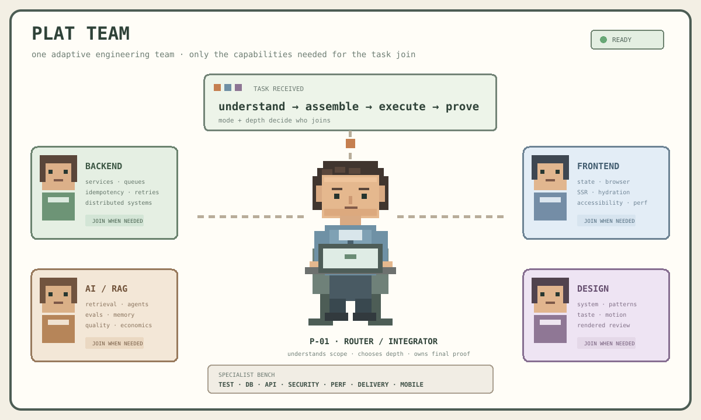
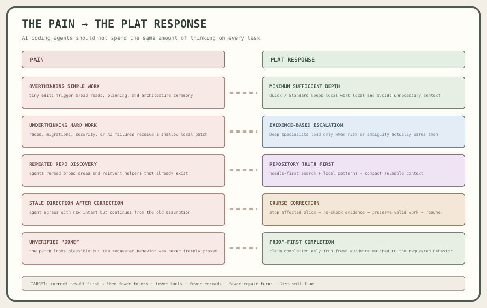
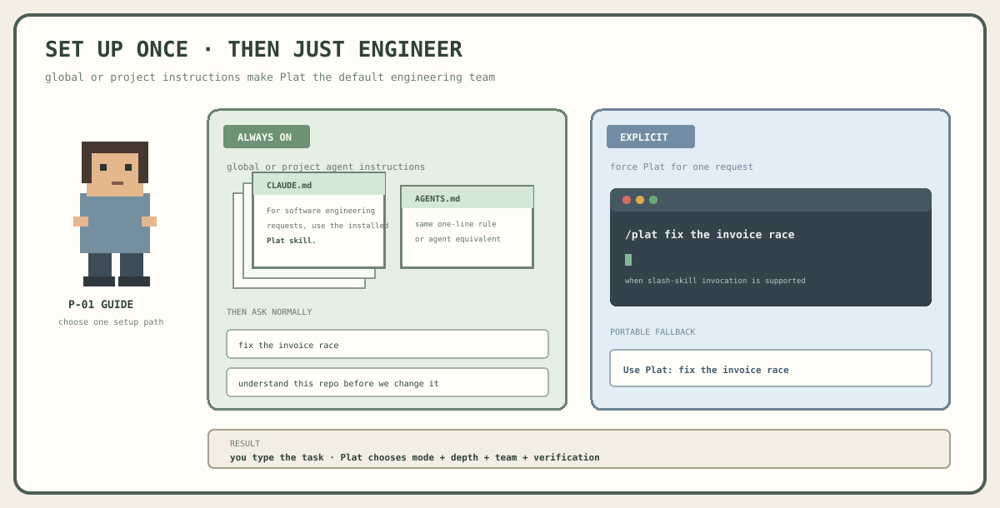
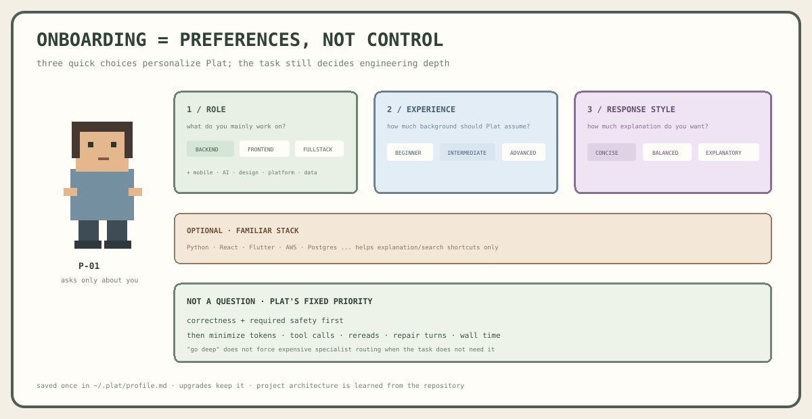
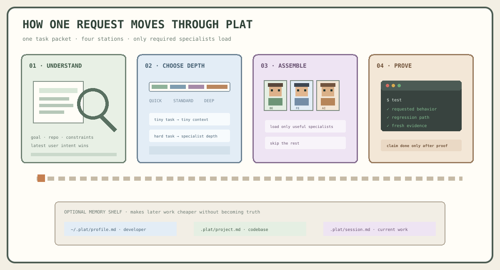
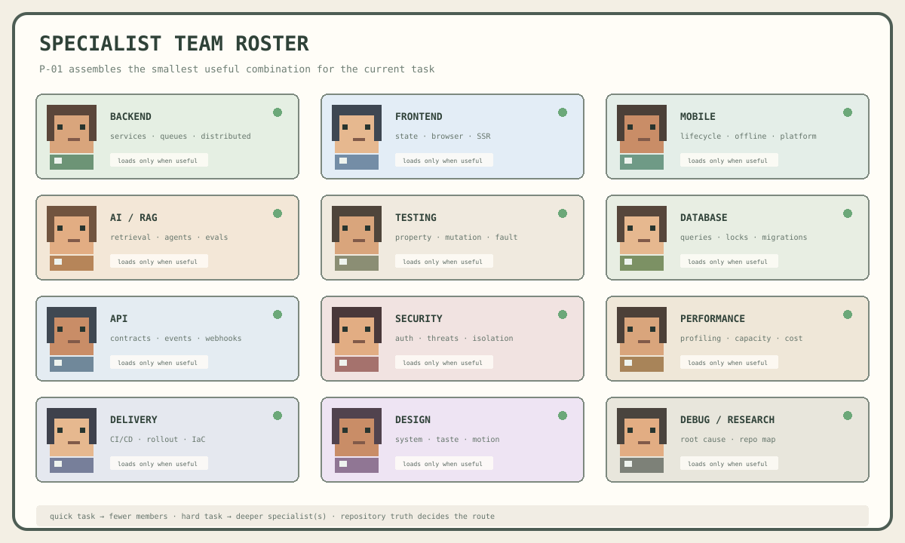
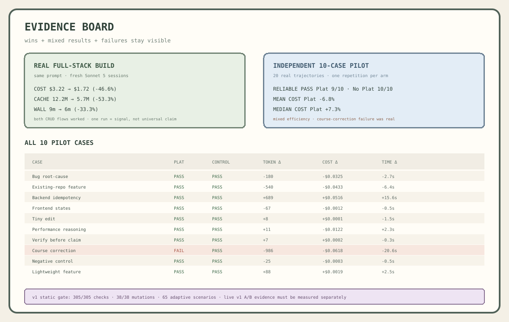
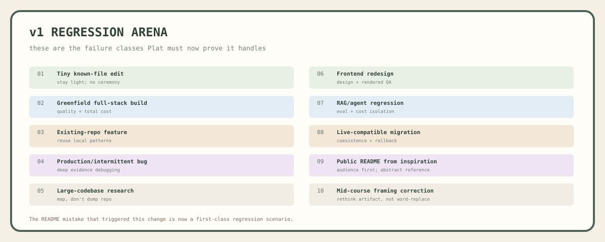
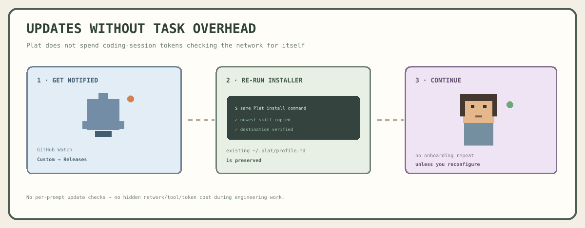
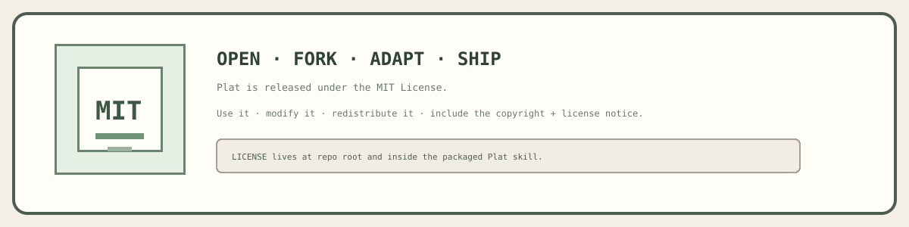

# Plat

**Minimum sufficient engineering depth for AI coding agents.**

Plat reduces unnecessary agent work caused by one-size-fits-all reasoning: overthinking easy tasks, underthinking hard ones, rereading repositories too broadly, continuing stale assumptions, and claiming completion without enough proof.

## The problem Plat solves

| Pain | Typical agent behavior | Plat response |
| --- | --- | --- |
| Simple task, too much ceremony | broad repo reads, plans, architecture discussion, extra tools | choose **Quick/Standard** and keep the task local |
| Hard task, too little rigor | local patch ignores concurrency, migration, security, runtime, or AI uncertainty | escalate to **Deep** only when evidence earns it |
| Repository rediscovery | reread broad areas and invent helpers that already exist | needle-first search + reuse local mechanisms |
| Stale direction | user corrects intent but the agent keeps building on old assumptions | stop affected slice, re-check evidence, resume from corrected direction |
| Generic expertise everywhere | unrelated instructions consume context | load only the specialist domain needed for the task |
| “Done” without proof | plausible patch, weak evidence | require fresh verification matched to the requested behavior |

> **Plat’s hypothesis:** the best coding-agent workflow is not “think more.” It is **use the smallest engineering team and depth that can solve the real problem correctly, then prove it.**

## Install

**macOS / Linux**

~~~bash
bash -c "$(curl -fsSL https://raw.githubusercontent.com/harish-042002/harish-skills/main/install.sh)"
~~~

**Windows PowerShell**

~~~powershell
iex (irm 'https://raw.githubusercontent.com/harish-042002/harish-skills/main/install.ps1')
~~~

The installer chooses the agent and skill install scope, copies Plat into the real agent skill directory, verifies the install, creates only the developer preference profile at **~/.plat/profile.md**, wires Plat into the agent instructions, and registers one user-level daily update checker. It does not create a project profile during installation.

## How Plat works

~~~text
request
  ↓
inspect repository truth
  ↓
choose MODE + minimum sufficient DEPTH
  ↓
load only relevant specialist guidance
  ↓
execute / investigate
  ↓
fresh verification
~~~

**Modes:** Build · Debug · Review · Research · Design · Optimize · Migrate  
**Depths:** Quick · Standard · Deep · Research

A request for a detailed explanation does **not** automatically trigger Deep engineering depth. Output preference and technical depth are separate.

Short follow-ups such as **"do it"**, **"continue"**, **"still wrong"**, or **"remove that"** are resolved from the latest active task, correction, diff/runtime evidence, and repository state before Plat asks a clarification question. If one safe interpretation clearly dominates, Plat acts; if materially different interpretations remain, it asks one focused question.

## Orchestrator + external specialist bench

Plat does **not** try to copy every deep specialist skill into its hot path. P-01 stays the lead and adds specialists only when a concrete unresolved engineering question earns the extra context.

~~~text
developer request
      ↓
P-01 resolves intent + repository evidence
      ↓
minimum sufficient depth
      ↓
can P-01 + one Plat reference finish safely?
   ├─ yes → act → prove
   └─ no
       ↓
   choose ONE specialist first
       ↓
   bounded brief
       ↓
   evidence report
       ↓
   P-01 arbitration
       ↓
   add another specialist only if evidence exposes
   a second material boundary
       ↓
   integrate → fresh proof
~~~

**P-01 keeps control of architecture, shared contracts, integration, conflict resolution, and the final answer.** Specialists do not recursively spawn more specialists on Plat's behalf. If one discovers another capability gap, it reports that need back to P-01.

External skills are discovered **metadata-first**. Plat prefers a narrow specialist over another broad orchestrator and normally reads/invokes only the best candidate first.

| Task | Default specialist budget |
| --- | --- |
| Quick | **0** |
| Standard | **0**, or 1 bounded consultant only for a real blocking capability gap |
| Deep | start with **1**; add another only when evidence proves another boundary; normally ≤3 total |
| Research | up to **3 independent read-only** specialists initially |

Parallel work is used only when tasks are genuinely independent. Shared contracts, schemas, migrations, central state, and overlapping mutations stay sequential unless isolation is explicit.

When specialists disagree, Plat **does not vote**. It reduces the disagreement to a concrete proposition and runs the smallest discriminating check. Direct current runtime/test/repository evidence outranks specialist confidence.

This lets Plat use a user's existing specialist-skill library without paying the cost of loading all of it on every task.

## Compatibility

| Host | Install path supported by installer | Notes |
| --- | --- | --- |
| Claude Code | Global or project-local | persistent CLAUDE.md instruction wiring |
| Codex | Global or project-local | persistent AGENTS.md instruction wiring |
| Cursor | Global or project-local | persistent Cursor rule / project instruction wiring |

Plat follows the standard Skill bundle shape: **SKILL.md + agents/openai.yaml + optional references/scripts/assets**. Host invocation details may differ, but the engineering instructions remain vendor-neutral.

## Evidence so far

Plat publishes positive results, mixed results, and failures together.

| Evidence | Result | What it means |
| --- | --- | --- |
| Real full-stack build | cost **$3.22 → $1.72**, wall **9m → 6m**, cache read **12.2M → 5.7M** | strong efficiency signal, but only one manual comparison |
| Independent 10-case pilot | reliable pass **Plat 9/10 vs No Plat 10/10** | no correctness advantage demonstrated |
| Independent pilot mean cost | **-6.8%** | favorable mean, but median was worse |
| Independent pilot median cost | **+7.3%** | mixed efficiency, no universal cost claim |
| Structural gate | **305/305** checks, **38/38** mutations, **65** adaptive scenarios | routing/coverage evidence only, not live-agent performance |

The course-correction case in the independent pilot **failed with Plat** and passed without it. That failure is documented rather than hidden, and it directly informed stronger repository-truth and course-correction rules.

## Technical docs

- **[Why Plat exists](docs/WHY_PLAT.md)** — pain points, response model, non-goals
- **[Architecture](docs/ARCHITECTURE.md)** — routing, depth, truth order, specialist loading, verification
- **[Benchmarks](docs/BENCHMARKS.md)** — methodology, all current numbers, failure case, next protocol
- **[Limitations](docs/LIMITATIONS.md)** — evidence gaps, host differences, probabilistic behavior, community validation
- **[Agent failure modes](skills/plat/references/agent-failure-modes.md)** — concrete behaviors Plat is designed to prevent
- **[Specialist orchestration](skills/plat/references/orchestration.md)** — external skill discovery, bounded communication, evidence arbitration
- **[Maintenance protocol](docs/MAINTENANCE.md)** — mandatory market scan → license check → adapt → test → release workflow for Plat changes
- **[Research log](docs/RESEARCH_LOG.md)** — public sources inspected and which principles were adopted/rejected

## Update

Plat does **not** spend engineering-session tokens checking the network for updates. The installer registers a user-level background task that checks GitHub Releases **once every 24 hours**, writes cached status to `~/.plat/update-status.json`, and shows an OS notification only when a newer version exists. To install the update, rerun the same installer command; existing developer preferences are preserved.

The background checker sends only a normal GitHub release request. It does not send repository code, prompts, profile contents, or project data.

## Current limitations

- Plat is early-stage and has limited community validation.
- Current live A/B evidence is not enough to claim a universal correctness, token, cost, or time advantage.
- Skill instructions improve behavior probabilistically; they cannot guarantee every agent follows every control perfectly.
- A routing mistake can itself create overhead, which is why over-escalation is a first-class benchmark failure mode.

